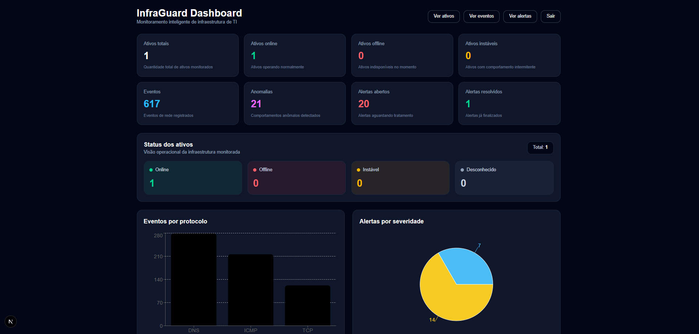
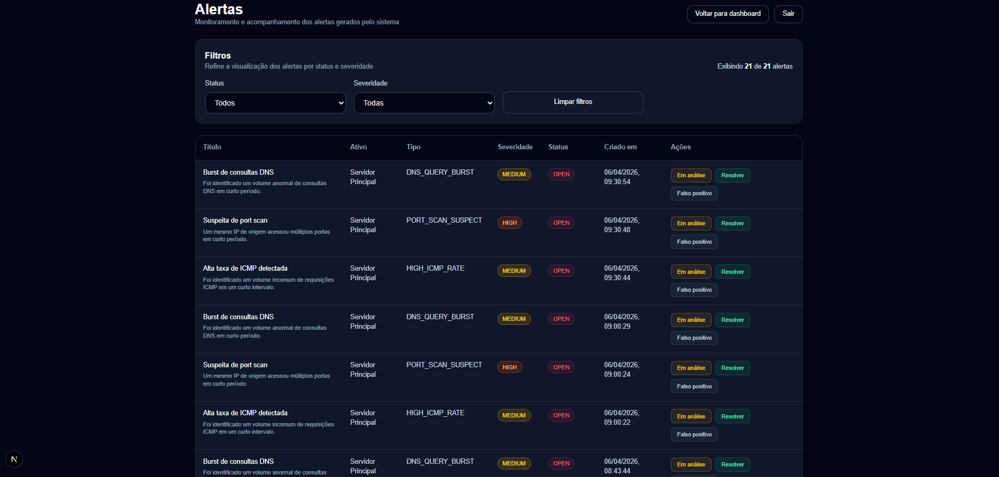
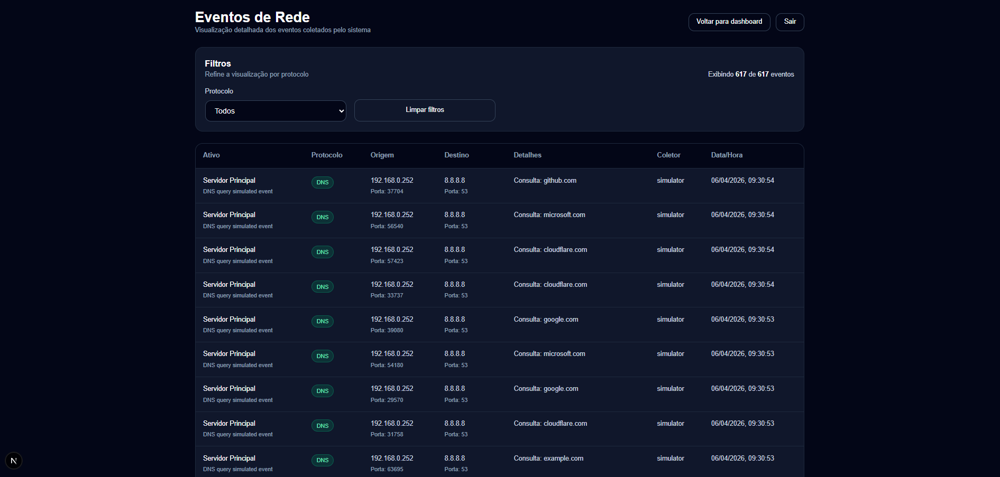
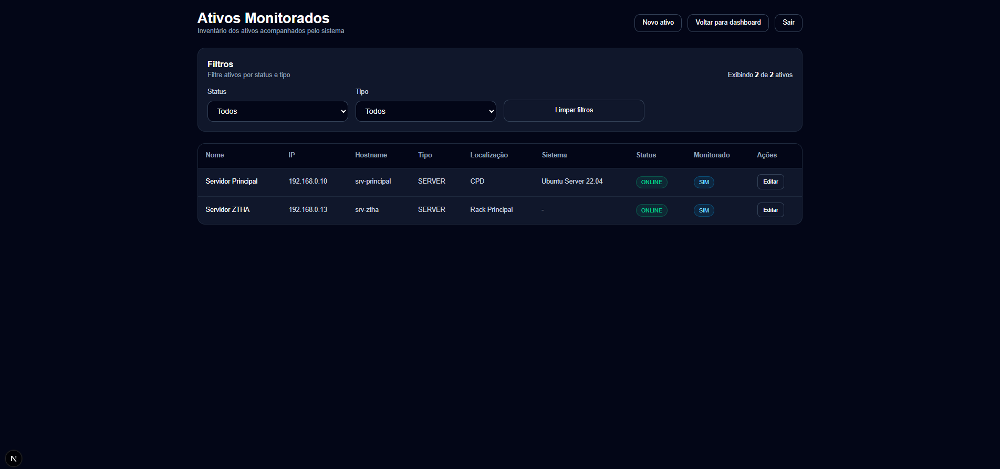

## Sistema Inteligente de Monitoramento de Infraestrutura de TI

Projeto desenvolvido como Trabalho de Conclusão de Curso (TCC) com o
objetivo de monitorar ativos de rede, coletar eventos, detectar
anomalias de protocolo e gerar alertas para identificação de possíveis
ameaças.

---

## Visão Geral

O sistema realiza:

- Monitoramento contínuo de ativos de TI
- Coleta de eventos de rede (TCP, ICMP, DNS)
- Detecção de comportamentos anômalos baseada em regras de limiar
- Mitigação de falsos positivos via allowlist e feedback do operador
- Geração e gerenciamento de alertas
- Visualização em dashboard interativo

---

## Arquitetura do Sistema

```
[ Coletor / Simulador ]
           ↓
[ API Backend - Django + DRF ]
           ↓
[ Banco de Dados - PostgreSQL ]
           ↓
[ Dashboard - Next.js ]
```

---

## Tecnologias Utilizadas

**Backend**
- Python
- Django
- Django REST Framework
- PostgreSQL
- SimpleJWT
- python-decouple

**Frontend**
- Next.js (App Router)
- React
- TypeScript
- Tailwind CSS
- Recharts

**Coletor**
- Python (requests, python-decouple)
- Nmap (cenário de port scan TCP)
- hping3 (cenário de flooding ICMP controlado)

**Autenticação**
- JWT (Bearer token) com refresh

---

## Funcionalidades

**Dashboard**
- Visão geral dos ativos (online, offline, instáveis, desconhecidos)
- Indicadores de eventos, anomalias e alertas
- Gráficos de eventos por protocolo e alertas por severidade
- Polling automático a cada 5 segundos

**Alertas**
- Listagem com filtros por status e severidade
- Mudança manual de status (OPEN, IN_PROGRESS, RESOLVED, FALSE_POSITIVE)
- Quando marcado como `FALSE_POSITIVE`, gera registro de feedback que
  suprime futuras anomalias equivalentes por 24h (configurável)

**Eventos de Rede**
- Visualização detalhada com filtro por protocolo (TCP, ICMP, DNS)

**Ativos**
- Inventário com status operacional e tipo
- Cadastro/edição via frontend
- Filtros por status e tipo

**Mitigações de Falsos Positivos**
- `TrustedSource`: allowlist de IPs ignorados pelo detector (Zabbix,
  scanners contratados, etc.) — gerenciado via Django Admin
- `FalsePositiveFeedback`: supressão temporária com base em decisões
  do operador

---

## Estrutura do projeto

```
monitoring-system-tcc/
├── backend/                      # Django + DRF
│   ├── apps/
│   │   ├── accounts/             # placeholder (usuários via auth padrão)
│   │   ├── assets/               # CRUD de ativos monitorados
│   │   ├── events/               # ingestão e listagem de eventos
│   │   ├── anomalies/            # detector + TrustedSource + Feedback
│   │   ├── alerts/               # alertas gerados pelo detector
│   │   └── dashboard/            # endpoints agregados
│   ├── config/                   # settings, urls
│   └── manage.py
│
├── collector/                    # simulador Python
│   ├── main.py
│   ├── simulator.py
│   ├── config.py                 # leitura de .env via decouple
│   └── services/
│       ├── api_client.py
│       ├── event_factory.py
│       └── network_tools.py      # Nmap e hping3 via subprocess
│
├── frontend/                     # Next.js + React + Tailwind
│   └── src/
│       ├── app/                  # rotas (App Router)
│       ├── components/
│       ├── lib/
│       └── types/
│
├── benchmark/                    # harness experimental
│   ├── scenarios.py              # gera A1..A3 e N1..N3
│   ├── measure.py                # tabula TP/FP/TN/FN
│   ├── sensitivity.py            # tabelas de sensibilidade
│   └── README.md
│
└── docs/                         # documentação interna
```

---

## Como executar o projeto

### Backend

```bash
cd backend
python -m venv venv
venv\Scripts\activate                  # Windows
# source venv/bin/activate             # Linux/Mac
pip install -r requirements.txt
python manage.py migrate
python manage.py createsuperuser
python manage.py runserver
```

### Frontend

```bash
cd frontend
npm install
npm run dev
```

### Collector

```bash
cd collector
pip install -r requirements.txt
# (opcional) cp .env.example .env e ajustar
python main.py
```

> O coletor executa Nmap no cenário de port scan e hping3 no cenário
> de flooding ICMP. Utilize esses testes somente em ativos próprios
> ou em ambiente controlado de laboratório. Caso as ferramentas não
> estejam instaladas, o coletor segue enviando apenas os eventos
> sintéticos, sem prejuízo à exercitação do detector.

### Benchmark (capítulo de Resultados do TCC)

Veja `benchmark/README.md` para o fluxo de geração de cenários,
matriz de confusão e tabelas de sensibilidade.

```bash
cd benchmark
python scenarios.py --repetitions 30   # 1. gera eventos
python measure.py                      # 2. tabula TP/FP/TN/FN
python sensitivity.py                  # 3. tabelas de sensibilidade
```

### Testes unitários do detector

```bash
cd backend
python manage.py test apps.anomalies
```

Cobertura atual: três regras (acima e abaixo do limiar), allowlist,
feedback ativo, feedback expirado, deduplicação.

---

## Configuração dos limiares (análise de sensibilidade)

Os limiares do detector estão em `settings.DETECTOR_THRESHOLDS` e
podem ser sobrescritos via variáveis de ambiente no `backend/.env`:

```env
ICMP_RATE_COUNT=20
ICMP_RATE_WINDOW_SECONDS=30
PORT_SCAN_DISTINCT_PORTS=10
PORT_SCAN_WINDOW_SECONDS=60
DNS_BURST_COUNT=30
DNS_BURST_WINDOW_SECONDS=60
DEDUPLICATION_WINDOW_SECONDS=60
FALSE_POSITIVE_SUPPRESS_HOURS=24
```

Reinicie o backend após a alteração.

---

## Objetivo do Projeto

Este projeto tem como objetivo demonstrar a viabilidade de um sistema
inteligente capaz de:

- Monitorar infraestrutura de TI em tempo próximo do real
- Identificar padrões anômalos de tráfego nos protocolos ICMP, TCP e DNS
- Auxiliar na detecção de ameaças
- Fornecer suporte à tomada de decisão operacional
- Mitigar falsos positivos por meio de allowlist e feedback humano

---

## Prints do Sistema

### Dashboard



### Alertas



### Eventos



### Ativos


